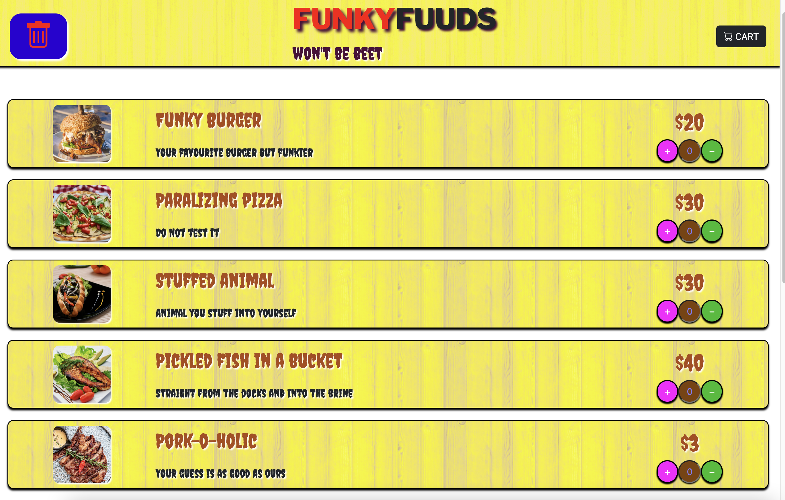
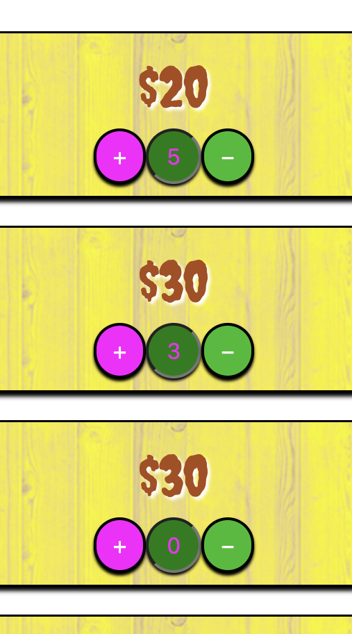
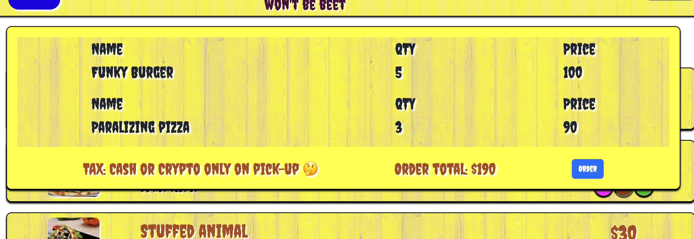

WELCOME TO FUNKYFUUDS!

Looks better than it tastes, and vice versa...
=========

## Project Summary

We present to you the one and only 'FUNKYFUUDS' which gives you, dear user, the opportunity to go to 
your FAVOURITE restaurant, SELECT your beloved dishes AND place the order. Once user places the order,
both user and restaurant will get notified via sms. User will receive text message when the order is ready AND restaurant will receive the list of the items which were ordered and user who ordered them.

Here we present to you the screenshots from our app: 

***
Here we can see the main page:

***

Here we have the option to add more or less items:

***

Want to check what you added? Click on the cart button:

***

Got everything? Just click the "Order" button:

***

Once the order is placed you will be notified via sms when your order will be ready.
The restaurant will get the message with the meals to prepare. Enjoy!

***

## Getting Started

1. Create the `.env` by using `.env.example` as a reference: `cp .env.example .env`
2. Update the .env file with your correct local information 
  - username: `labber` 
  - password: `labber` 
  - database: `midterm`
3. Install dependencies: `npm i`
4. Fix to binaries for sass: `npm rebuild node-sass`
5. Reset database: `npm run db:reset`
  - Check the db folder to see what gets created and seeded in the SDB
7. Run the server: `npm run local`
  - Note: nodemon is used, so you should not have to restart your server
8. Visit `http://localhost:8080/`

## Dependencies

- Node 10.x or above
- NPM 5.x or above
- PG 6.x
- Twilio
